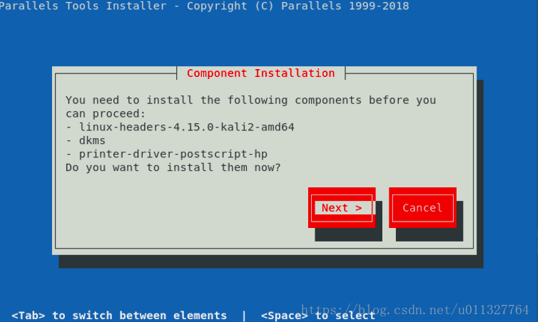

# Kali安装

## 系统安装

+ 下载镜像

  地址：https://www.kali.org/downloads/

  安装`Kali Linux 64 Bit`版本，其他版本可能会出错

+ 按步骤安装操作系统即可，安装过程中如有疑问，可以参加[安装 Kali linux](https://wizardforcel.gitbooks.io/daxueba-kali-linux-tutorial/content/4.html) 

## 安装Parallels Tools

### kali不适合安装`Parallels Tools`

+ `Parallel Desktop`中安装kali时，并不适合安装`Parallels Tools`，系统中的`Xorg`会与`Parallels Tools`产生冲突，导致无法进入图形化界面

+ 参见[Xorg 1.20 not compatible! Latest 13.3.1-43365 fixes nothing!](https://forum.parallels.com/threads/xorg-1-20-not-compatible-latest-13-3-1-43365-fixes-nothing.344639/) 

+ 这个问题在[在Kali Linux 2018.2中安装Parallels Tools](https://blog.csdn.net/u011327764/article/details/81380261)的评论中也可以找到

  > 如果不是必须，就不要安装`Parallels Tools`了

### 安装`Parallels Tools`方法

> 参见[在Kali Linux 2018.2中安装Parallels Tools](https://blog.csdn.net/u011327764/article/details/81380261) 

+ 问题1

  + 没有权限安装`Parallels Tools`

    操作 → 安装`Parallels Tools`，进入`/media/cdrom`下，执行`./install`，会提示没有执行权限

  + 解决方案

    重启虚拟机，重新在`Parallels`中挂载`Parallels Tools`，然后执行如下命令

    ```shell
    umount /meida/cdrom
    mount -o exec /media/cdrom
    cd /media/cdrom
    ./install
    ```

+ 问题2

  + 缺少依赖

    安装过程中报错如下：

     

  + 解决方案

    + 执行如下命令查看需要的依赖的版本

      ```shell
      root@kali:~# uname -a
      Linux kali 4.18.0-kali2-amd64 #1 SMP Debian 4.18.10-2kali1 (2018-10-09) x86_64 GNU/Linux
      ```

      可见，本系统使用的是`2018-10-09`发布的版本

    + 在[本地址](http://http.kali.org/kali/pool/main/l/linux/)下载如下文件（需要对应自己的版本）：

      + linux-kbuild-4.18_4.18.10-2kali1_amd64.deb
      + linux-headers-4.18.0-kali2-common_4.18.10-2kali1_all.deb
      + linux-headers-4.18.0-kali2-amd64_4.18.10-2kali1_amd64.deb

    + 将上述文件上传至kali，依次执行如下命令

      ```shell
      $ dpkg -i linux-kbuild-4.18_4.18.10-2kali1_amd64.deb
      $ dpkg -i linux-headers-4.18.0-kali2-common_4.18.10-2kali1_all.deb
      $ dpkg -i linux-headers-4.18.0-kali2-amd64_4.18.10-2kali1_amd64.deb
      ```

      > + 安装过程中可能会提示需要依赖`linux-compiler-gcc-7-x86`
      >
      > + 执行`apt-get install linux-compiler-gcc-7-x86`即可，执行过程中可能还会报错，提示需要先运行`apt --fix-broken install`，则按照该提示执行该命令，然后u继续安装即可

    + 然后继续安装`Parallels Tools`即可